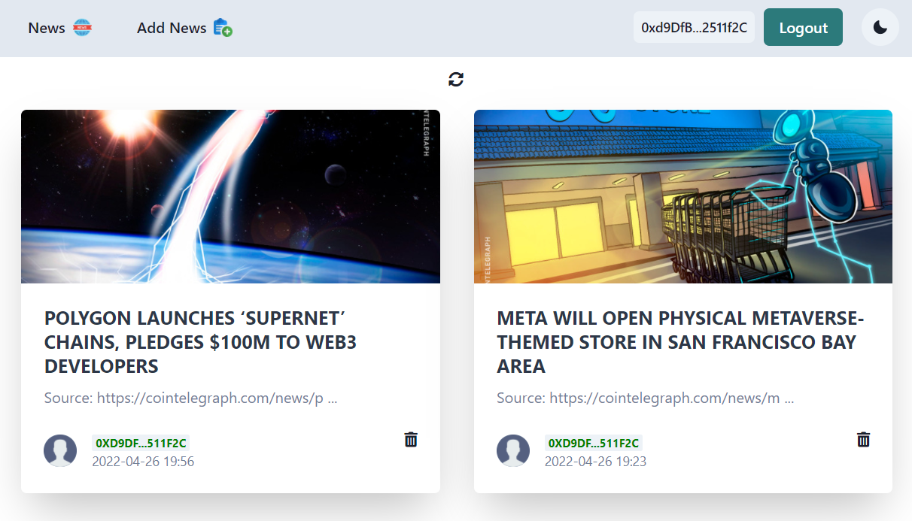

  

# Decentralized News Portal

Decentralized News Portal on blockchain where everyone who has some news can share it by connecting their wallet to the portal and confirm the transaction.

----------

## Presentation

- **Live demo:** [https://news-portal.pages.dev/](https://news-portal.pages.dev)

----------

## Features:

- Responsive design;
- Dark/Light Mode;
- Ability to see all the news posted (with the date & the address wallet of the author);
- Ability to add news on the portal;
- Possibility to upload multiple photos (using the button or drag and drop) in the article;
- Only the contract owner can delete the news;

----------

## Demo screen:

----------

## Deployment

Smart Contract deployed to BNB Testnet chain. App deployed on
Cloudflare and is available on [this site](https://news-portal.pages.dev) but must have Metamask installed on your computer to interact with smart contract.

### Technology Stack and Tools

* [Metamask Wallet](https://metamask.io/)
* [React](https://reactjs.org/) - front end framework
* [Solidity](https://docs.soliditylang.org/en/v0.7.4/) - ethereum smart contract language
* [Web3](https://web3js.readthedocs.io/en/v1.3.0/) - library interact with ethereum nodes
* [JavaScript](https://www.javascript.com/) - logic front end and testing smart contracts
* [IPFS Infura](https://infura.io/) - connection to ethereum networks
* [Chacra ui](https://chakra-ui.com/) - UI component library

## Installation

Installing this project to use on your machine is simple. First,

`git clone https://github.com/mario-work/NewsPortal.git`

the repository. Next, navigate to the cloned directory

`cd NewsPortal`

and install the necessary Node.js modules with

`npm install`

Finally, to open the web app,

`npm run start`

You need to have Metamask Wallet. Connect to the app using your wallet. When connected, your address will show on the top navigation bar.

------------

Todos

- [ ] Adding categories and tags for news, as well as filtering news
- [ ] Add a more powerful text editor
- [ ] Add the ability to rate news
- [ ] Adding the ability to leave comments on news
- [ ] Adding a dashboard with functions for the admin
